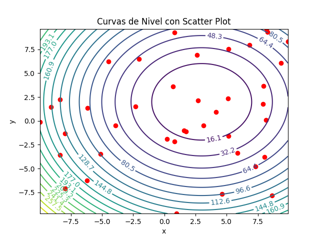
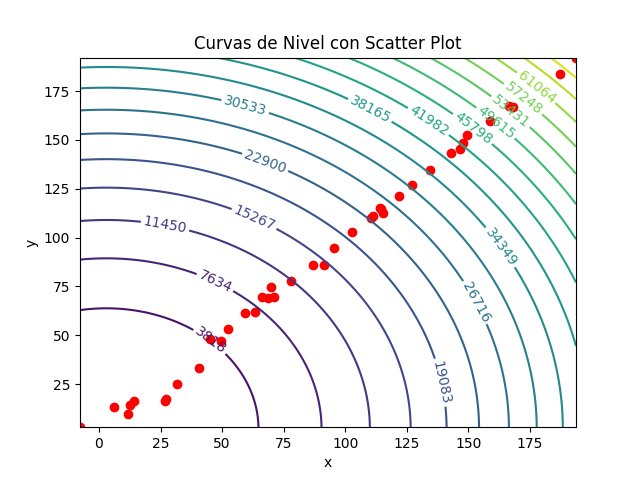
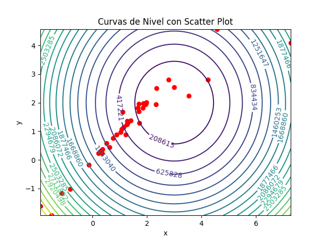

# Laboratorio 1 Modelación y Simulación

## Integrantes
- Gustavo González
- Diego Leiva
- Pablo Orellana

## Output
```commandline
Best value: 0.0008194846282362871
Best position: [3.02468879 2.01448959]
```

## Contour Plot
1. Principio  
   
2. Mitad  
   
3. Final  
    